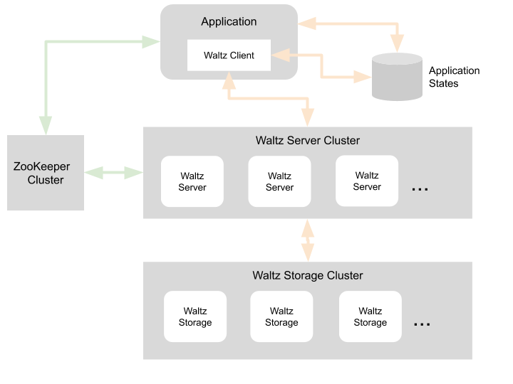

* **Waltz Client**: A client code that runs in an application. It discovers Waltz servers to communicate through Zookeeper. Multiple clients can write to the same log concurrently.
* **Waltz Server**: A server that works as a proxy to Waltz storages and also is responsible for concurrency control.
* **Waltz Storage**: A storage server that provides persistency of data. It stores transaction data in its local disk.
Transaction ID: A persistent unique id sequentially assigned to a committed transaction in a partition.
Transaction Header: Transaction header is a 32-bit integer value. Its semantics is application defined. The transaction headers are streamed back to clients along with transaction IDs so that clients can do certain optimizations before fetching the transaction bodies through RPC. For example, it can be used to signify the type of transaction, and an application can fetch and process only transactions it is interested.
* **Transaction Data**: Transaction data are opaque to Waltz. They are just byte arrays for Waltz. An application must provide a serialization method to Waltz Client.
* **High-water Mark**: A high-water mark is the highest transaction ID seen. For a Waltz server it is the ID of the most recently committed transaction. For a client, it is the ID of the most recently consumed transaction.
* **Lock ID**: A partition scoped id for optimistic locking. It consists of a name and long id. Waltz does not know what a lock ID represents. The scope of a lock ID is limited to the partition. Therefore, a partitioning scheme must be decided taking a lock ID scope into consideration.
* **Waltz Client Callbacks**: An application code that Waltz client invoke to communicate with the application.
* **Transaction Context**: A client application code that packages the logic to generate a transaction. The code may be executed multiple times until the transaction succeeds, or the transaction context decides to give up.
* **Zookeeper**: We use Zookeeper to monitor participating servers. We also store some cluster wide configuration parameters (the number of partitions, the number of replicas) and metadata of storage state. The storage metadata is updated/access only when faults occur, thus the load on Zookeeper is small.

The system consists of four kinds of processes, application processes, Waltz Server processes, Waltz Storage processes, and Zookeeper server processes.

An application process serves application specific services. It generates transaction data and sends them to Waltz Server using Waltz Client running inside the application. The application receives all committed transactions in the commit order from Waltz Server and updates application’s database.

Waltz Server works as a proxy to Waltz Storage. Servers receive read/write requests from clients and forward them to storages. It also works as a lock manager and a cache of transaction data.

Waltz Storage manages the log storage files. A log is segmented into multiple files. For each segment there is an index file which gives mapping from transaction IDs to transaction records.
Lastly, Waltz uses Zookeeper to control the whole Waltz system. For example, Zookeeper is used to store metadata regarding storage states. Zookeeper is also used to keep track of Waltz Server instances. Waltz Client instances are informed where Waltz Server instances are.
